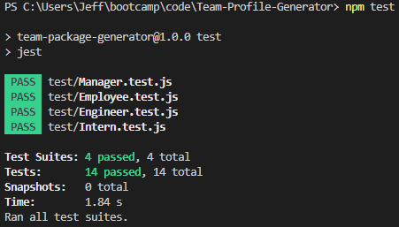
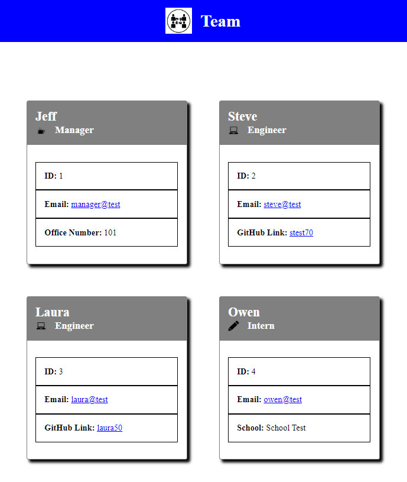

  # Team-Profile-Generator
  

  [](https://opensource.org/licenses/MIT)
  
 
  ## Description
  This application utilized node and inquirer to allow the user to create team consisting of 1 manager, then as many engineers and interns as the user would like to enter. Upon the completion of creating each team member the user can view a document page that will show the newly created team with applied CSS.


  ## User Story

```md
AS A manager
I WANT to generate a webpage that displays my team's basic info
SO THAT I have quick access to their emails and GitHub profiles
```

## Acceptance Criteria

```md
GIVEN a command-line application that accepts user input
WHEN I am prompted for my team members and their information
THEN an HTML file is generated that displays a nicely formatted team roster based on user input
WHEN I click on an email address in the HTML
THEN my default email program opens and populates the TO field of the email with the address
WHEN I click on the GitHub username
THEN that GitHub profile opens in a new tab
WHEN I start the application
THEN I am prompted to enter the team manager’s name, employee ID, email address, and office number
WHEN I enter the team manager’s name, employee ID, email address, and office number
THEN I am presented with a menu with the option to add an engineer or an intern or to finish building my team
WHEN I select the engineer option
THEN I am prompted to enter the engineer’s name, ID, email, and GitHub username, and I am taken back to the menu
WHEN I select the intern option
THEN I am prompted to enter the intern’s name, ID, email, and school, and I am taken back to the menu
WHEN I decide to finish building my team
THEN I exit the application, and the HTML is generated
```
 
  ## Table of Contents
  - [Installatoin](#installation)
  - [Usage](#usage)
  - [Contributing](#contributing)
  - [Tests](#tests)
  - [Screenshot](#screenshot)
  - [Links](#links)
  - [Questions](#questions)
  
 
  ## Installation
  
  To install use command: 

  npm i
  
 
  ## Usage
  
   - In order to use this application you first need to clone the repository to your local machine.
  - Then follow installation instructions to install all dependecnies for the application withing the directory
  - Run the application with command "node index.js" in the terminal
  - Answer all of the prompts to create each team member
  - After you have created all of the team members you want, select the finish option to generate the markdown.
  - Open the newly created index.html file within the output folder to view your finished new team document.
 
  ## Contributing
  

  If you would like to contribute to this repository, follow these instructions: 
  

  This repository is open to the public to access, please feel free to comment.
  
 
  ## Tests
  
  To run the test use command "npm test" in the terminal

  ## Screenshot

  

  

  ## Links

  Video Demo:
  https://app.castify.com/watch/2ace997f-96c7-4103-8995-538896bdcf68

  Repository:
  https://github.com/jcgilbert70/Team-Profile-Generator.git
  
 
  ## Questions
  Any questions about this project please contact the creator jcgilbert70 at:
  jcgilbert70@gmail.com
  

  Check out other repositories by this creator at: https://github.com/jcgilbert70
  

  ## License: MIT
  
 
  MIT License Link: https://opensource.org/licenses/MIT

  
